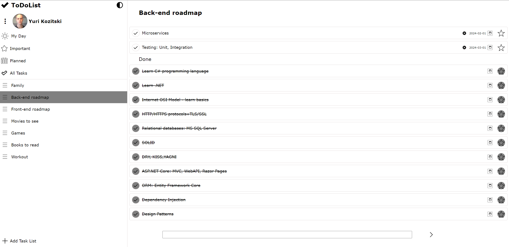
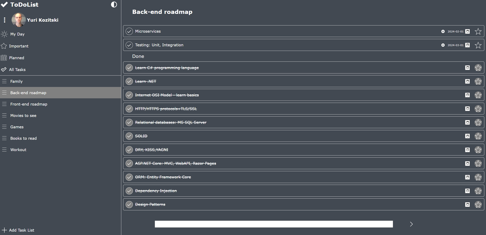
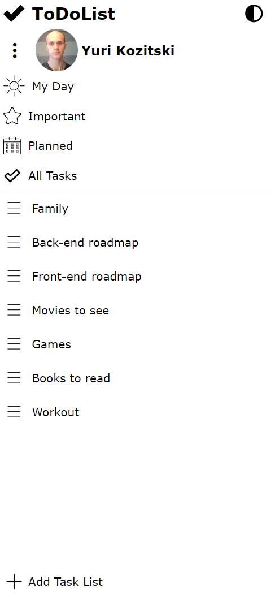
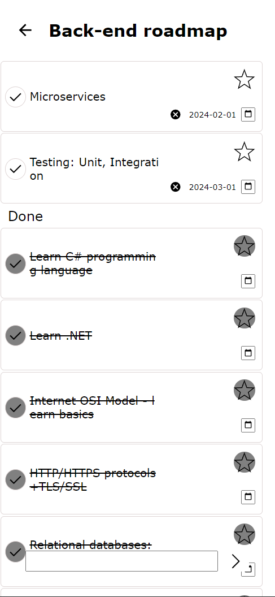

# ToDoList application(Onion Architecture, CQRS, MediatR, React+Redux)
  This is ToDoList application with a lot functionality such as making your task lists, adding tasks to particular tasklists,
aslo user can mark some of tasks as important, planned at particular date or just done. App is designed with Onion Architecture 
alongside with CQRS which is implemented using MediatR. Asp.Net Core Identity with JWT as authentication technology. 
Server(Fluent Validation) and client-side validation also included. NLog used for logging.
  For front-end used React with Redux. Responsive design implemented.

#### Light theme:

#### Dark theme:

#### Mobile view №1:

#### Mobile view №2:

# Features
- C#
- HTML
- CSS
- JavaScript
- React
- Redux
- Asp.Net Core 7
- REST API
- Entity Framework Core
- SQL Server Express
- Asp.Net Identity
- JWT
- NLog
- AJAX
- Authorization/Authentication
- Onion Architecture
- CQRS
- MediatR
- Visual Studio 2022 IDE
